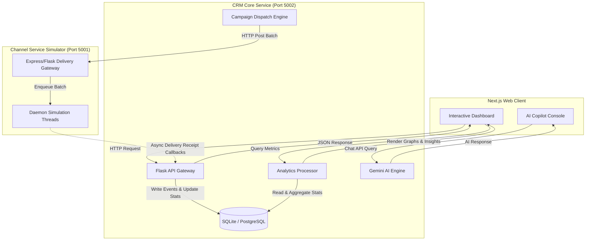
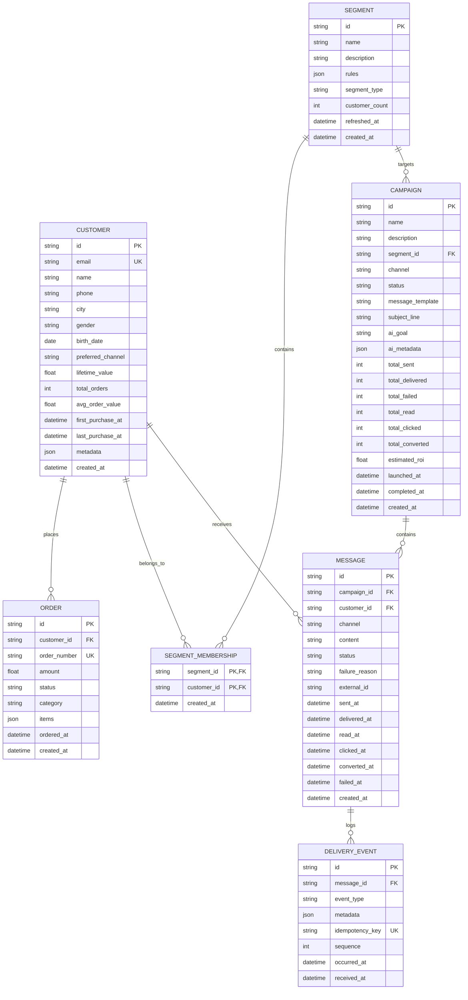

# Resonance CRM — AI-Native DTC Marketing Hub

Resonance CRM is an **AI-native Customer Relationship Management (CRM) and Campaign Engine** tailored for DTC brands. Built to address the challenges of modern multi-brand commerce, the platform supports distinct identity environments (e.g., **Aura Fashion**, **Brew & Co**, and **Bloom Beauty**) in a single system. 

It comes out of the box with a high-fidelity seeded dataset of 1,000 customers, detailed multi-year purchase logs, smart segment queries, and historical campaigns with complete delivery and conversion analytics, allowing reviewers to immediately evaluate the system.

---

## Product Point of View

Traditional CRMs are designed for B2B pipelines, relying on manual contact entry, stages, deals, and massive contact lists. Resonance CRM throws this away in favor of a **marketer-centric, intent-to-campaign workflow** optimized for DTC e-commerce:

1. **Intent-Driven Audience Segmentation**: Instead of writing complex SQL queries or clicking through nested filters, marketers express their intent in natural language (e.g., *"Find VIP shoppers in Delhi who haven't purchased in 60 days"*). The AI Copilot compiles this into structured segment rules.
2. **Channel-Aware Personalization**: The system automatically drafts message copies personalized for the target segment's attributes (name, location, previous purchase categories) and recommends the channel they are most responsive to (WhatsApp, Email, or SMS).
3. **Simulated Delivery & Asynchronous Callbacks**: Once a campaign is launched, messages are pushed to a simulated channel gateway that mocks real-world message delivery latencies, temporary route failures, carrier routing blocks, and human open/click actions via background loops.
4. **Actionable Analytics Trend Dashboard**: Every status update callback regenerates campaign-level and aggregate conversion funnels, revenue impact tracking, and daily trend lines.

---

## System Architecture

The project consists of three core services, designed to operate in high-fidelity synchronization:



### Component Responsibilities

1. **Next.js Frontend Client (Port 3000)**: Responsive React application using Shadcn UI, TailwindCSS, and Recharts. Features modular layouts for Customers, Audience Segments, Campaigns, and the AI Copilot console.
2. **CRM Service (Port 5002)**: Built on Python (Flask & SQLAlchemy). Owns the core business models (Customers, Orders, Segments, Campaigns, Messages) and manages segment evaluation, template compilation, and callback webhook processing. Integrates Gemini 2.0 Flash to translate natural language to segment criteria.
3. **Channel Service Simulator (Port 5001)**: A standalone Python application mimicking an external messaging service (like Twilio or Gupshup). It processes sent batches in the background using daemon worker threads, firing mock delivery receipt webhooks (Sent, Delivered, Failed, Read, Clicked, Converted) back to the CRM service with realistic randomized delay offsets.

---

## Entity Relationship (ER) / Data Model

The database schema is optimized to store immutable audit logs of events while keeping query performance high using denormalized counters on campaigns:



---

## Key Files & Code Directory

Here are the most critical implementation files that you should refer to during a live review:

* [**`crm-service/app/__init__.py`**](file:///Users/hrithik/Downloads/Xeno%20Internship/crm-service/app/__init__.py): Application factory setup. Includes the automatic database creation (`db.create_all()`) and the **self-healing startup hook** that auto-seeds historical data if the local SQLite DB is empty.
* [**`crm-service/app/routes.py`**](file:///Users/hrithik/Downloads/Xeno%20Internship/crm-service/app/routes.py): REST API controller. Defines routing logic for ingestion, segment building, campaign launching, copilot chat, and the webhook callback processor.
* [**`crm-service/app/services/campaign_service.py`**](file:///Users/hrithik/Downloads/Xeno%20Internship/crm-service/app/services/campaign_service.py): Core dispatcher. Compiles personalized template patterns (e.g., `{{first_name}}`), segments audiences, handles batching constraints, and connects to the simulator gateway.
* [**`crm-service/app/services/analytics_service.py`**](file:///Users/hrithik/Downloads/Xeno%20Internship/crm-service/app/services/analytics_service.py): Metrics aggregator. Computes real-time funnels, attribution gains, and timelines.
* [**`channel-service/app/simulator/engine.py`**](file:///Users/hrithik/Downloads/Xeno%20Internship/channel-service/app/simulator/engine.py): Simulator core. Spawns asynchronous daemon threads per message to walk through delivery state progressions (`QUEUED` $\rightarrow$ `SENT` $\rightarrow$ `DELIVERED` $\rightarrow$ `READ` $\rightarrow$ `CLICKED` / `CONVERTED`), simulating real delays.
* [**`frontend/src/app/page.tsx`**](file:///Users/hrithik/Downloads/Xeno%20Internship/frontend/src/app/page.tsx): Main dashboard shell with charts, top campaigns table, and sidebar navigational hooks.

---

## Backend API Simulation

The services communicate over REST. Below are the core API patterns and examples to query locally.

### Start the Local Servers
Running the local environments is automated via npm:
```bash
# From the repository root
npm run dev
```

This concurrently starts:
* **Frontend**: `http://localhost:3000`
* **CRM Core Service**: `http://localhost:5002`
* **Channel Service Simulator**: `http://localhost:5001`

### Useful API Endpoints

#### 1. Ingest/Fetch Customers
```bash
# Query customers with filters
curl "http://localhost:5002/api/customers?city=Mumbai&min_ltv=5000"
```

#### 2. Create AI Segment Rules
```bash
curl -X POST "http://localhost:5002/api/segments/draft-rules" \
     -H "Content-Type: application/json" \
     -d '{"prompt": "Delhi shoppers with over 5 orders and spent more than 10000"}'
```

#### 3. Launch a Campaign
```bash
curl -X POST "http://localhost:5002/api/campaigns/<campaign_id>/launch"
```

---

## Scale Assumptions and Trade-offs

During your system design or code review, you can discuss the following architectural choices:

| Component | Current Implementation (Prototype) | Production Scale Alternative | Rationale |
| :--- | :--- | :--- | :--- |
| **Database** | SQLite | PostgreSQL / Snowflake / ClickHouse | SQLite allows zero-setup running. Production scale requires ClickHouse or Snowflake for real-time analytics aggregation, and PostgreSQL for transactional data. |
| **Worker Queues** | Daemon Python threads in Simulator | RabbitMQ / Celery / Kafka | Python threads in memory will be lost on server crash. Production systems require persistent messaging brokers like Kafka or SQS to guarantee delivery receipt processing. |
| **Counters** | Denormalized columns on Campaign table | Redis / Distributed Counters | Updating SQL rows on every callback receipt creates lock contention at scale. Real-time open/click clicks should increment Redis counters before batch-flushing to SQL. |
| **Webhook Delivery** | Synchronous REST Callback | Event-driven gateway + Pub/Sub | Directly calling the CRM server from the simulator can cause request timeouts under high load. A message queue should decouple webhook receipts from ingestion logic. |

---

## AI-Native Development Notes

The platform is designed around **Gemini 2.0 Flash** integration to remove complexity for marketers:

* **Intent Planning**: Translates natural language expressions into type-checked JSON parameters representing database filter conditions (cities, AOV, registration dates).
* **Copywriting Copilot**: Marketers write a brief goal (e.g. "Warm re-engagement coupon for Holi") and select a tone. The AI evaluates the customer demographics and drafts channel-compliant copies (short SMS, interactive WhatsApp buttons, formatted emails).
* **Automated Insights**: On the analytics page, the AI reads real-time performance metrics and lists prioritized suggestions (e.g., *"WhatsApp campaigns show a 4x higher CTR than SMS for Aura Fashion. We recommend moving budget."*).

---

## Run Locally

### Requirements
* Python 3.10+
* Node.js 18+

### Step-by-Step Setup

1. **Clone and Install Backend Dependencies**:
   ```bash
   cd crm-service
   python3 -m venv venv
   source venv/bin/activate
   pip install -r requirements.txt
   ```

2. **Configure Environment Variables**:
   Create a `.env` file in `crm-service/`:
   ```env
   SECRET_KEY=resonance-dev-secret
   DATABASE_URL=sqlite:///resonance.db
   CHANNEL_SERVICE_URL=http://localhost:5001
   AI_PROVIDER=gemini
   GEMINI_API_KEY=your_gemini_api_key_here
   ```

3. **Run Services**:
   You can run each service individually or run `npm run dev` in the root folder to spin them up concurrently.

   * **CRM Service**:
     ```bash
     cd crm-service
     flask run -p 5002
     ```
   * **Channel Service**:
     ```bash
     cd channel-service
     flask run -p 5001
     ```
   * **Frontend**:
     ```bash
     cd frontend
     npm install
     npm run dev
     ```

---

## Submission Checklist

- [x] **Fully Seeding DB**: Database seeds 1,000 customers and multi-year data histories on first run.
- [x] **Callback Simulation**: Asynchronous multi-stage callback delivery webhook simulation completes with simulated failures (route blocks/routing restricts).
- [x] **Clean UI**: Beautiful dark-mode dashboard with real-time conversion rates and Campaign Activity Trend metrics.
- [x] **Interactive Copilot**: Sidebar AI assistant capable of drafting campaigns, building segments, and generating smart suggestions.
